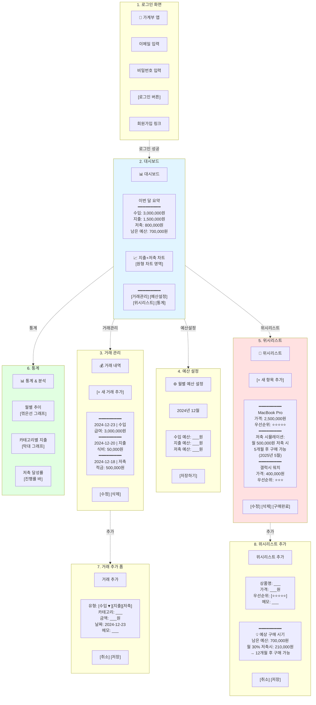

# Budget App

개인 예산 관리를 위한 웹 애플리케이션입니다. React, TypeScript, Supabase를 사용하여 구축되었습니다.

## 기능

- 🔐 사용자 인증 (회원가입, 로그인, 로그아웃)
- 💰 거래 내역 관리 (수입, 지출, 저축)
- 📊 대시보드 개요 (월별 요약, 최근 거래)
- 💼 예산 관리 (월별 예산 설정, 진행률 추적)
- 🎯 위시리스트 (저축 목표 설정 및 관리)

## 기술 스택

### Frontend
- **Vite** - 빌드 도구
- **React 18** - UI 라이브러리
- **TypeScript** - 타입 안정성
- **React Router** - 라우팅
- **Tailwind CSS v4** - 스타일링
- **Recharts** - 차트 라이브러리
- **date-fns** - 날짜 처리

### Testing
- **Vitest** - 테스트 프레임워크
- **React Testing Library** - 컴포넌트 테스트
- **MSW (Mock Service Worker)** - API 모킹

### Backend
- **Supabase** - BaaS (Backend as a Service)
  - PostgreSQL 데이터베이스
  - 인증 시스템
  - Row Level Security (RLS)

## 프로젝트 구조

```
budget_app/
├── database/
│   └── schema.sql          # Supabase 데이터베이스 스키마
├── frontend/               # 웹 애플리케이션
│   ├── src/
│   │   ├── components/     # React 컴포넌트
│   │   ├── pages/          # 페이지 컴포넌트
│   │   ├── lib/            # 유틸리티 및 설정
│   │   ├── types/          # TypeScript 타입 정의
│   │   └── tests/          # 테스트 파일
│   ├── .env.example        # 환경 변수 템플릿
│   └── package.json
├── mobile/                 # Android 모바일 앱 (Capacitor)
│   ├── capacitor.config.ts # Capacitor 설정
│   ├── package.json
│   └── README.md           # 모바일 앱 설정 가이드
└── README.md
```

## 설치 방법

### 1. 저장소 클론

```bash
git clone https://github.com/yshyuk/budget_app.git
cd budget_app
```

### 2. Supabase 프로젝트 설정

1. [Supabase](https://supabase.com)에서 새 프로젝트 생성
2. `database/schema.sql` 파일의 내용을 Supabase SQL Editor에서 실행
3. 프로젝트 설정에서 API URL과 anon key 확인

### 3. 환경 변수 설정

```bash
cd frontend
cp .env.example .env
```

`.env` 파일을 열어 Supabase 정보를 입력:

```env
VITE_SUPABASE_URL=your_supabase_project_url
VITE_SUPABASE_ANON_KEY=your_supabase_anon_key
```

### 4. 의존성 설치

```bash
npm install
```

### 5. 개발 서버 실행

```bash
npm run dev
```

브라우저에서 `http://localhost:5173`을 열어 앱을 확인할 수 있습니다.

## Gmail 연동 설정 방법 (선택사항)

Gmail API를 연동하면 카드 결제 승인 이메일을 자동으로 파싱하여 거래 내역에 추가할 수 있습니다.

### 1. Google Cloud Console 설정

1. [Google Cloud Console](https://console.cloud.google.com)에 접속
2. 새 프로젝트 생성 (예: budget-app-gmail)
3. "API 및 서비스" > "라이브러리"에서 "Gmail API" 검색하여 사용 설정
4. "API 및 서비스" > "OAuth 동의 화면"으로 이동
   - 사용자 유형: 외부 선택
   - 앱 이름, 사용자 지원 이메일, 개발자 연락처 정보 입력
   - 범위 추가: `https://www.googleapis.com/auth/gmail.readonly`
5. "API 및 서비스" > "사용자 인증 정보"로 이동
6. "사용자 인증 정보 만들기" > "OAuth 클라이언트 ID" 선택
7. 애플리케이션 유형: "웹 애플리케이션" 선택
8. 승인된 JavaScript 원본: `http://localhost:5173` 추가
9. 승인된 리디렉션 URI: `http://localhost:5173` 추가
10. 생성된 클라이언트 ID 복사

### 2. 환경 변수 추가

`.env` 파일에 다음 내용 추가:

```env
# Google OAuth for Gmail Integration
VITE_GOOGLE_CLIENT_ID=your_client_id_here
```

### 3. Gmail 연동 사용

1. 앱 실행 후 "Gmail 연동" 메뉴로 이동
2. "Gmail 계정 연동" 버튼 클릭
3. Google 계정으로 로그인하고 권한 승인
4. 날짜 범위를 선택하고 "이메일에서 거래 내역 가져오기" 클릭
5. 파싱된 거래 내역을 확인하고 선택적으로 저장

### 지원하는 카드사

- 신한카드
- 삼성카드
- 현대카드
- 국민카드
- 하나카드
- 우리카드
- 롯데카드
- NH농협카드

### 보안 및 개인정보

- Gmail 읽기 권한만 사용하며, 이메일을 수정하거나 전송하지 않습니다
- 이메일 내용은 브라우저에서만 처리되며 외부 서버로 전송되지 않습니다
- OAuth 토큰은 브라우저 로컬 스토리지에 안전하게 저장됩니다
- 언제든지 연동을 해제할 수 있습니다

## 테스트

### 테스트 실행

```bash
# 모든 테스트 실행
npm run test

# 테스트 UI 모드로 실행
npm run test:ui

# 커버리지 리포트와 함께 실행
npm run test:coverage
```

### 테스트 구조

테스트는 각 컴포넌트와 같은 디렉토리의 `__tests__` 폴더에 위치합니다:

```
src/
├── components/
│   ├── __tests__/
│   │   ├── TransactionForm.test.tsx
│   │   ├── TransactionList.test.tsx
│   │   ├── BudgetForm.test.tsx
│   │   ├── BudgetProgress.test.tsx
│   │   ├── WishlistForm.test.tsx
│   │   └── WishlistItem.test.tsx
│   └── ...
├── contexts/
│   └── __tests__/
│       └── AuthContext.test.tsx
└── pages/
    └── __tests__/
        ├── Login.test.tsx
        └── SignUp.test.tsx
```

### 테스트 커버리지

주요 테스트 영역:
- ✅ 인증 플로우 (로그인, 회원가입, AuthContext)
- ✅ 거래 관리 (CRUD 작업)
- ✅ 예산 관리 (설정, 진행률 계산)
- ✅ 위시리스트 (저축 목표 관리)
- ✅ 폼 검증 및 에러 처리

## 빌드

프로덕션 빌드를 생성하려면:

```bash
npm run build
```

빌드된 파일은 `dist/` 디렉토리에 생성됩니다.

## 데이터베이스 스키마

주요 테이블:

- **transactions** - 거래 내역 (수입, 지출, 저축)
  - type: 'income' | 'expense' | 'saving'
  - category, amount, transaction_date, description

- **budgets** - 월별 예산 설정
  - year, month
  - income_budget, expense_budget, saving_budget

- **wishlist_items** - 위시리스트 아이템
  - item_name, target_amount, current_amount
  - priority (1-5), target_date, is_purchased

자세한 스키마는 `database/schema.sql` 파일을 참조하세요.

## 모바일 앱 (Android)

웹 애플리케이션과 동일한 기능을 제공하는 Android 앱입니다.

### 특징
- 📱 Android 폰 및 태블릿 지원
- 🔄 웹과 동일한 백엔드 (Supabase) 사용
- ⚡ Capacitor 기반으로 빠른 성능
- 🎨 모바일 최적화된 UI

### 설치 및 개발

자세한 내용은 [`mobile/README.md`](mobile/README.md)를 참조하세요.

**빠른 시작:**

```bash
# 1. 의존성 설치
cd mobile
npm install

# 2. Android 프로젝트 생성 (처음 한 번만)
npx cap add android

# 3. 웹 빌드 및 동기화
npm run build

# 4. Android Studio에서 열기
npm run android
```

**요구사항:**
- Android Studio (최신 버전)
- Android SDK (API 33+)
- Node.js 18+

## 구성도



## 라이선스

MIT

## 기여

이슈 및 풀 리퀘스트를 환영합니다!
